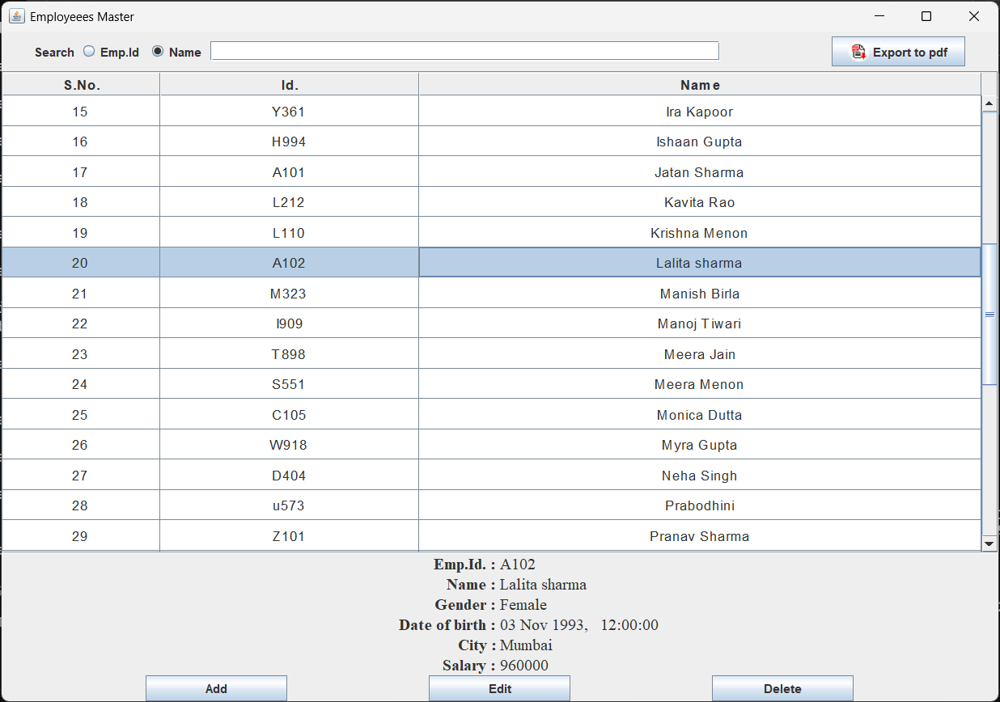
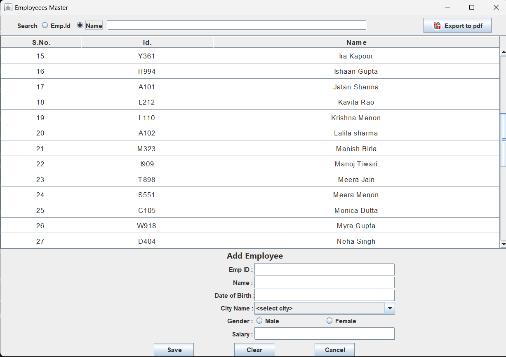
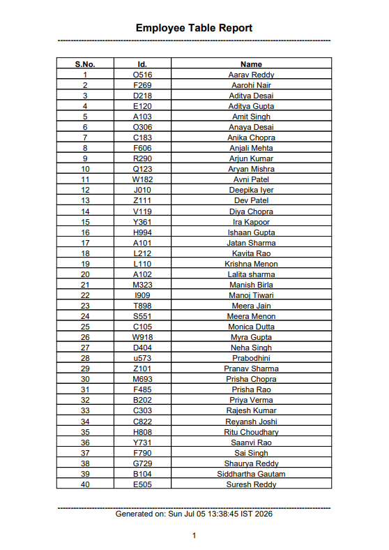

# Employee Management System

A Java Swing desktop application for managing employee records — add, edit, delete,
search, and export to PDF — backed by MySQL. On first launch the app **automatically
creates its database and tables, pre-seeded with data**.

## Features

- Add, edit, delete, and search employees
- Master–detail table view built on a custom `AbstractTableModel`
- Export the employee table to a formatted PDF report (iText)
- Input validation for dates, salary, and required fields
- **Automatic database setup on first run** — no manual SQL import needed
- **Pre-seeded with major states and cities** so the Add/Edit dropdowns work out of the box
- Database credentials kept out of the code, in an external `db.properties` file

## Screenshots



*The main window: a searchable list of employees with add / edit / delete and PDF export.*



*The add window: Adding a new employee: fill in ID, name, date of birth, city, gender, and salary, then Save.*



*The exported pdf: One-click PDF export: a paginated, formatted Employee Table Report with headers and page numbers.*

## Tech Stack

Java (Swing / AWT) · MySQL (JDBC) · iText (PDF generation)

## Requirements

- JDK 8 or later
- MySQL Server 8.x, running locally
- A MySQL account allowed to create databases (e.g. `root`) — needed the first time
- MySQL Connector/J and iText jars (included in `lib/` in the release)

## Quick Start (from a release download)

1. Download and unzip the latest release from the [Releases](../../releases) page.
2. Make sure your MySQL server is running.
3. Copy the config template and fill in your MySQL credentials:
   ```
   copy db.properties.example db.properties
   ```
4. Run the app:
   ```
   java -jar EmployeeManagementSystem.jar
   ```
   On first launch it creates the `employees_database` database and its tables
   automatically. On later runs your existing data is preserved.

## Run from source

```
javac -cp "lib/*" -d bin src/awtCRUD.java
java  -cp "bin;lib/*" EmployeeCRUD
```

Run from the project root so `db.properties`, `database/schema.sql`, and `resources/`
resolve correctly. On Linux/macOS use `:` instead of `;` in the classpath.

## Configuration (`db.properties`)

| Key | Meaning |
|-----|---------|
| `db.driver` | JDBC driver class name |
| `db.serverUrl` | Connection to the MySQL server (no database) — used for first-run setup |
| `db.name` | Name of the database the app creates/uses |
| `db.url` | Full JDBC URL including the database |
| `db.user` / `db.password` | MySQL credentials (needs create rights on first run) |

## How first-run setup works

1. The app connects to the MySQL **server** using `db.serverUrl`.
2. It checks whether the database named in `db.name` already exists.
3. If not, it creates the database and runs `database/schema.sql` to build the
   tables and seed them with major Indian states and cities.
4. On subsequent runs the database exists, so setup is skipped and data is kept.

## Adding cities or states

To add more cities or states, use the MySQL CLI:

```
mysql -u root -p employees_database
```

```sql
-- Add a new city to an existing state (state looked up by name)
INSERT INTO city (name, state_code)
VALUES ('Vellore', (SELECT code FROM state WHERE name = 'Tamil Nadu'));

-- Add a brand-new state, then a city in it
INSERT INTO state (name) VALUES ('Lakshadweep');
INSERT INTO city (name, state_code)
VALUES ('Kavaratti', (SELECT code FROM state WHERE name = 'Lakshadweep'));
```

Restart the app to see the new entries in the City dropdown.

## Project Structure

| Path | Purpose |
|------|---------|
| `src/awtCRUD.java` | Application source (UI, models, DB access, PDF export) |
| `database/schema.sql` | Database schema + seed data (states & cities) |
| `resources/` | Images and assets (e.g. the export button logo) |
| `db.properties.example` | Configuration template |
| `lib/` | Dependency jars (bundled in releases) |

## Troubleshooting

- **"Database Configuration Error"** — `db.properties` is missing, or the JDBC
  driver jar isn't on the classpath.
- **"Database Setup Error"** — MySQL isn't running, or the configured user can't
  create databases. Use an account with the required privileges.
- **"Access denied ... to database"** — the MySQL user lacks rights on that database.
- **"Public Key Retrieval is not allowed"** — keep `allowPublicKeyRetrieval=true`
  in the URLs (already set in the template).

## License

Released under the MIT License — see [LICENSE](LICENSE).
